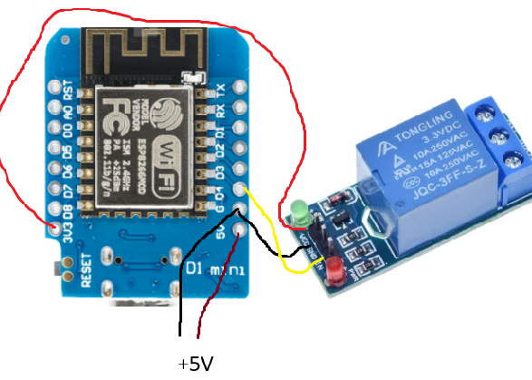
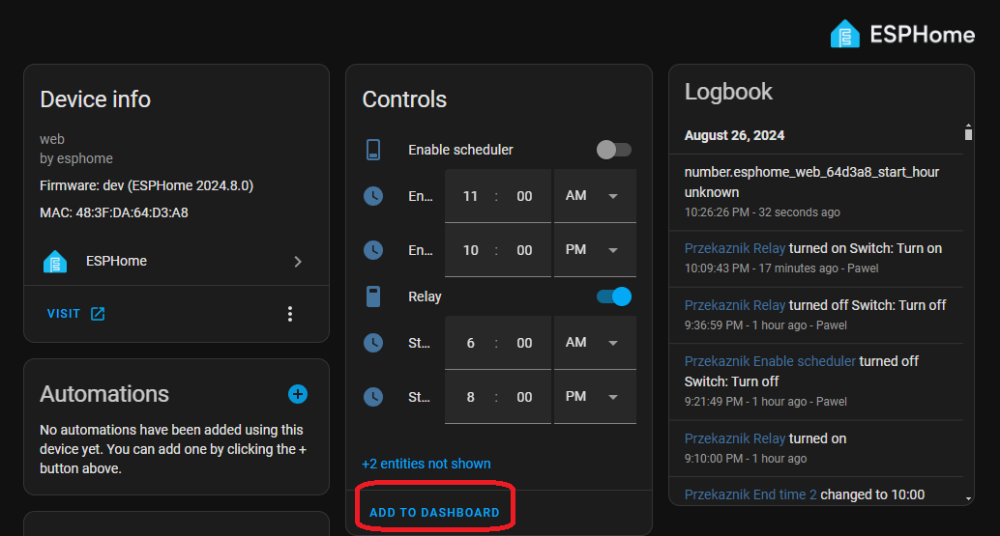
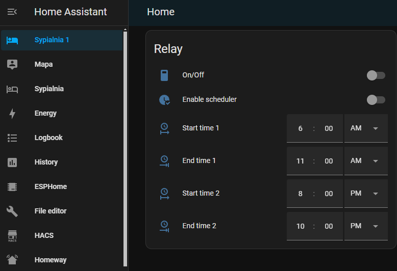

# home-assistant-relay
EspHome yaml for relay with internal scheduler based on ESP 8266

## Project goals
The aim of this project was creating "intelligent" power socket with several characteristics:
- managed from Home Assistant (HA)
- WIFI connection
- scheduler operated by device itself without a need for creating additional automations on HA level

There are many such devices on the market, however all are dedicated for Tuya, not a option to use them in Home Assistant directly.
In case of Zigbee models, they can be used in HA, however without scheduling functionality (which is accessible if the same device is used in Tuya).

## Main project features
- hardware based on esp8266 mini with standard relay 

- Home Assistant as main automation platform 
- ESPHome for managing software for esp8266

## Hardware
I used ESP8266 mini, however any other version of ESP 8266 or ESP 32 could be used as well.
I used 3.3 V Relay, for 5V relay, 5V pin from ESP should be used.
It is also important not to plug USB cable and external 5V power supply at the same time, since it could damage the chip.

## Installation
- Prepare all required hardware, e.g. esp8266 (esp32 is also ok), 3,3V or 5V relay
- Install Home Assistant (https://www.home-assistant.io/installation/) . In my case I used Raspberry 4 as HA server.
- Install ESPHome addon to HA: https://esphome.io/guides/getting_started_hassio.html
- Use "New Device" button on ESPHome page, choose "Open ESPHome Web" option, follow instructions.
- Copy content of [esphome-relay.yaml](esphome-relay.yaml) script in place of newly created ESPHome configuration,
modifying ESP chip type and other params if needed, e.g. relay pin in section: switch/platform: gpio/pin
- If everything is ok, you will see new device under Settings/Devices&Services/ESPHome

Result in HA dashboard

Using screen shown above, you can control relay directly using On/Off button, or configure a scheduler.
There are two periods defined (by modifying source code it could be reduced to single one, or expanded to additional periods).
Scheduler is active only if "Enable Scheduler" switch is on.
Since current state of scheduler is written to ESP8266 flash memory, any changes in scheduler config survive device reboots.
Relay could be controlled from PC or mobile phone from local network or from Internet if additional addon is installed (e.g. Homeway : https://homeway.io/)

## How it works

Scheduling task is implemented using ESP chip. It simplifies HA configuration, since there are no additional automations needed.
In order to make this possible, there is a section "datetime:" in ESPHome YAML file responsible for defining GUI elements which are visible on HA dashboard
and allow end user to check and modify scheduler settings.
Another key element of YAML config is "time" section, which is responsible for getting current time from Internet and executing scheduler job.
This job is written as C++ code in "on_time" lambda, runs every minute.
If current time is within any defined scheduler period, relay is switched to ON, if not, it is switched to OFF.
This logic is executed only if "scheduler_enabled" flag is set to true. 
This is only an example of scheduler implementation, where we only define periods when relay needs to be switched to ON.
Alternatively we can define time events, specifying if relay should be switched to ON or OFF for each such event.   
Using ESPHome is in this case is much easier than writing all C++ code by hand.
